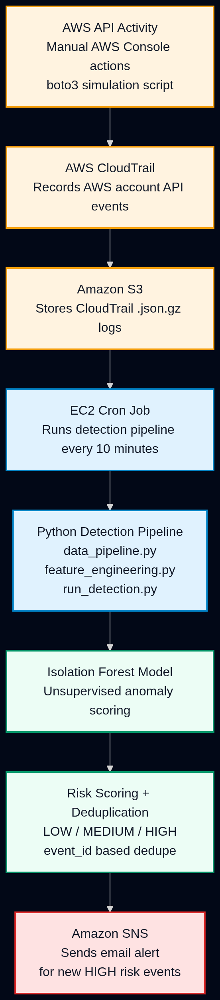
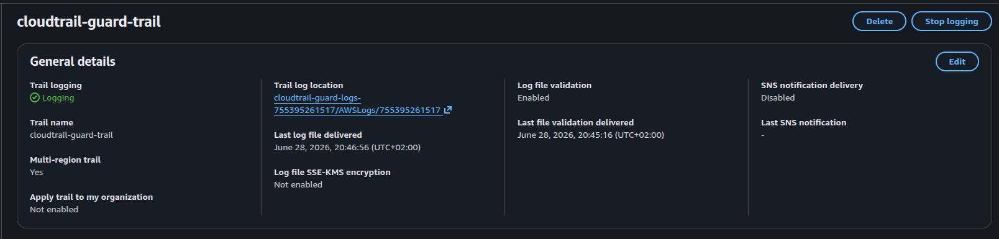
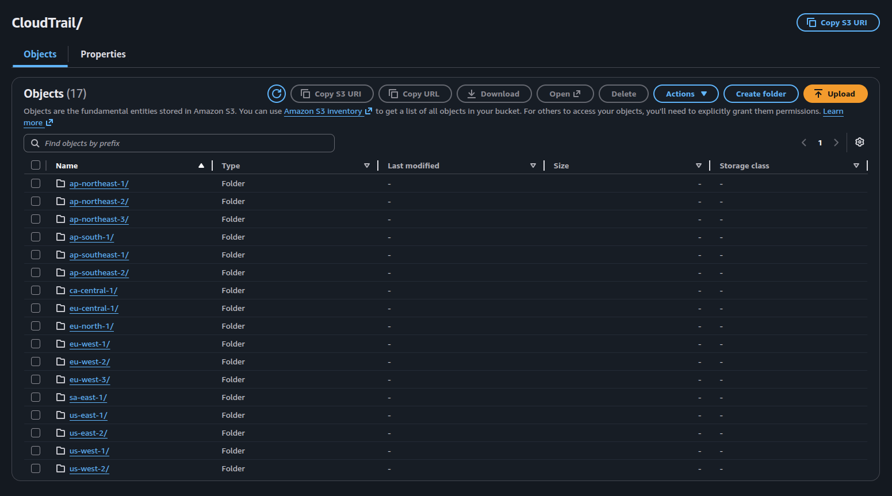
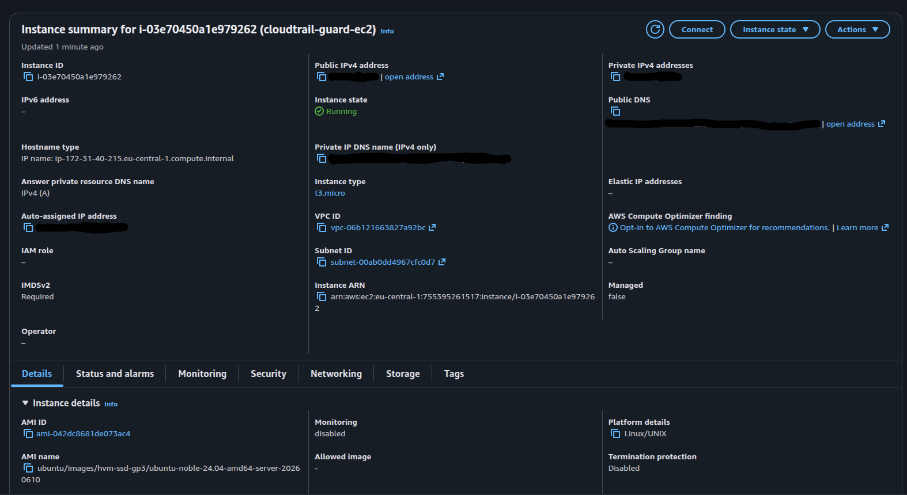
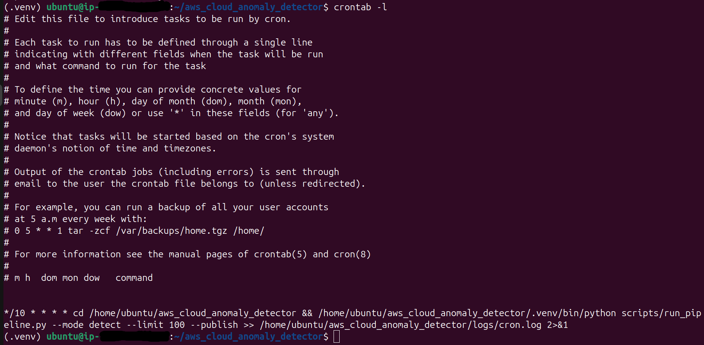
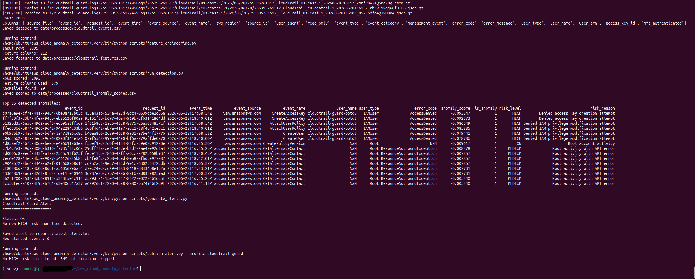
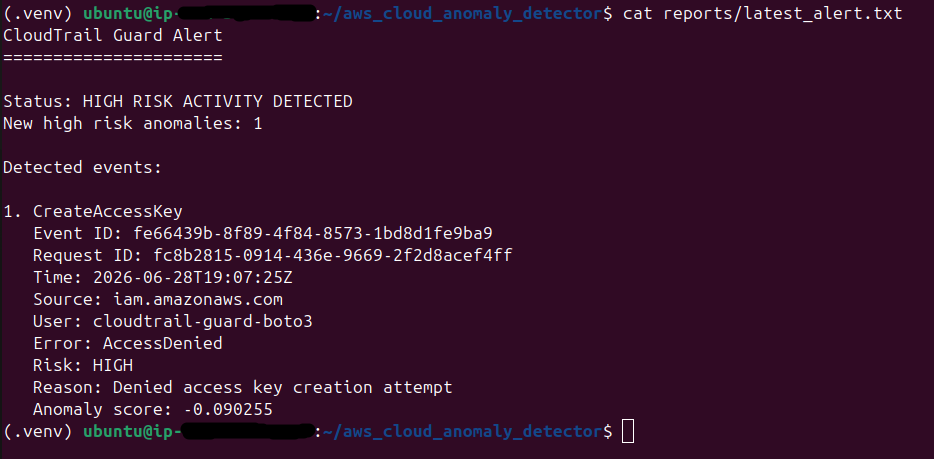
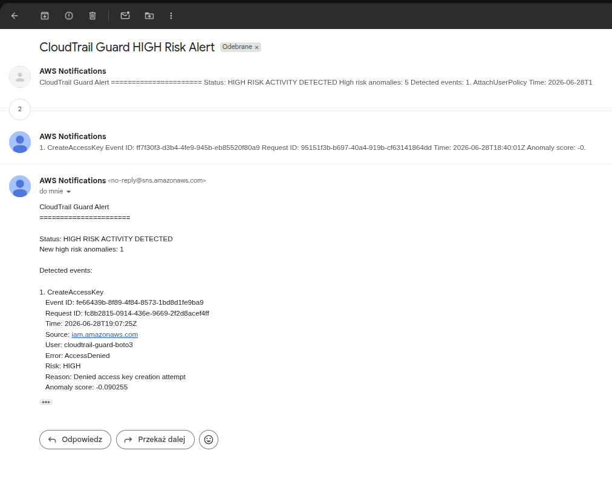
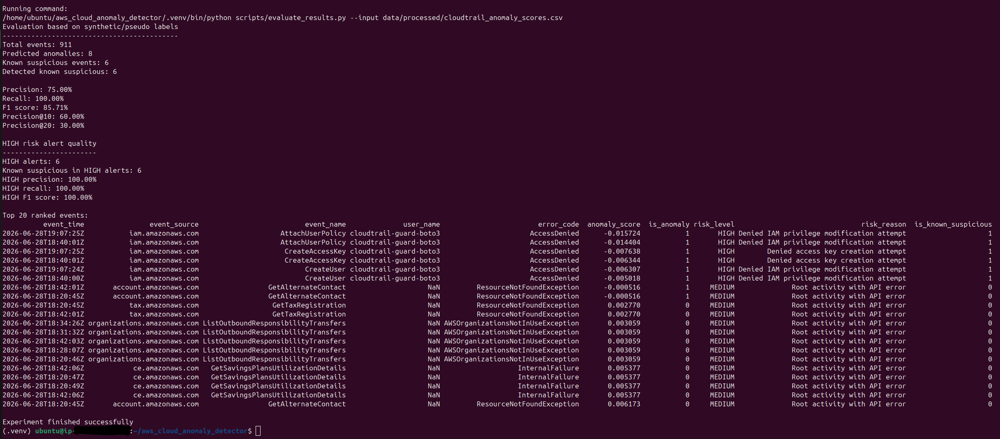

# CloudTrail Guard - AWS Anomaly Detection Pipeline

CloudTrail Guard is an end-to-end cloud security project that detects suspicious AWS API activity from CloudTrail logs and sends email alerts for high-risk anomalies.

The project combines AWS infrastructure, Python data processing, unsupervised machine learning, scheduled EC2 execution, and SNS alerting. It was built as a practical portfolio project focused on cloud security monitoring rather than a toy local-only ML notebook.

## What It Does

CloudTrail Guard collects AWS CloudTrail management events from S3, transforms raw JSON logs into machine learning features, scores events with an Isolation Forest model, assigns risk labels, deduplicates already-alerted events, and sends email notifications through Amazon SNS when new HIGH risk activity is detected.

Example high-risk events include denied IAM privilege actions such as:

- `CreateUser`
- `AttachUserPolicy`
- `CreateAccessKey`

These events are generated in a controlled way with the simulation script, then detected from real CloudTrail logs delivered by AWS.

## Architecture



Pipeline flow:

1. AWS account activity is generated through the AWS Console or a boto3 simulation script.
2. CloudTrail records AWS API events.
3. CloudTrail delivers compressed `.json.gz` logs to S3.
4. An EC2 cron job runs the detection pipeline every 10 minutes.
5. Python scripts ingest S3 logs, flatten CloudTrail records, and build ML features.
6. An Isolation Forest model scores events as normal or anomalous.
7. Rule-based risk scoring adds operational severity: LOW, MEDIUM, HIGH.
8. Alert deduplication prevents repeated emails for the same CloudTrail event ID.
9. SNS sends an email when a new HIGH risk anomaly is found.

## AWS Infrastructure

CloudTrail is configured as a multi-region trail and delivers management events to S3.



CloudTrail logs are stored in S3 under the standard `AWSLogs/<account-id>/CloudTrail/` prefix.



The detection pipeline runs on a small EC2 instance using a Python virtual environment and cron.



The cron job runs the detection pipeline every 10 minutes.



## Repository Structure

```text
scripts/
  data_pipeline.py        # Downloads CloudTrail logs from S3 and flattens events
  feature_engineering.py  # Converts CloudTrail events into numeric ML features
  train_model.py          # Trains the Isolation Forest model
  run_detection.py        # Scores events with the trained model
  generate_alerts.py      # Creates readable HIGH risk alert reports with dedupe
  publish_alert.py        # Publishes HIGH risk alerts to SNS
  run_pipeline.py         # Operational runner for train/detect pipeline modes
  run_experiment.py       # Train/detect split experiment for model evaluation
  split_events.py         # Splits events into training and detection windows
  simulate_attack.py      # Generates controlled CloudTrail activity for testing

docs/screenshots/         # Project evidence and README screenshots
```

Runtime artifacts are intentionally ignored by Git:

```text
data/
models/
reports/
state/
logs/
.venv/
```

## Configuration

The scripts use a named AWS profile by default:

```text
cloudtrail-guard
```

Required environment variables:

```bash
export CLOUDTRAIL_BUCKET="cloudtrail-guard-logs-<account-id>"
export CLOUDTRAIL_PREFIX="AWSLogs/<account-id>/CloudTrail/"
export CLOUDTRAIL_GUARD_SNS_TOPIC_ARN="arn:aws:sns:<region>:<account-id>:cloudtrail-guard-alerts"
```

AWS credentials should be configured outside the repository, for example in:

```text
~/.aws/credentials
~/.aws/config
```

No AWS access keys, secret keys, `.pem` files, model artifacts, datasets, or alert state files should be committed.

## Setup

Create and activate a virtual environment:

```bash
python3 -m venv .venv
source .venv/bin/activate
pip install -r requirements.txt
```

For EC2 deployment, Ubuntu Server 24.04 LTS with Python 3.12 was used.

## Running the Pipeline

Train the model:

```bash
python scripts/run_pipeline.py --mode train --limit 100
```

Run detection and generate a local alert report:

```bash
python scripts/run_pipeline.py --mode detect --limit 100 --alert
```

Run detection and publish a HIGH risk alert to SNS:

```bash
python scripts/run_pipeline.py --mode detect --limit 100 --publish
```

Example pipeline output:



## Alerting

The alert generator reads detection results from:

```text
data/processed/cloudtrail_anomaly_scores.csv
```

It writes the latest human-readable alert to:

```text
reports/latest_alert.txt
```

It also stores already-alerted CloudTrail event IDs in:

```text
state/alerted_event_ids.txt
```

This prevents sending the same HIGH risk event repeatedly on every cron run.

Example alert report:



Example SNS email alert:



## Simulated Attack Scenario

The simulation script generates controlled AWS API activity through boto3. It supports normal read-only activity, reconnaissance bursts, and blocked privilege escalation attempts.

Run a denied IAM activity simulation:

```bash
python scripts/simulate_attack.py --mode denied --repeat 1
```

CloudTrail may take a few minutes to deliver new logs to S3. After delivery, the EC2 cron job or a manual pipeline run can detect the activity and send an alert.

## Evaluation

Because this is an unsupervised anomaly detection project, there is no production ground-truth label set. Evaluation is based on pseudo-labels from controlled suspicious IAM events generated during testing.

The experiment runner creates a time-based train/detect split, removes known suspicious events from the training window, trains the model, scores the detection window, and reports precision/recall/F1 against pseudo-labels.

Run the experiment:

```bash
python scripts/run_experiment.py --limit 200
```

Example experiment metrics:



Important note: these metrics validate the controlled detection scenario. They should not be interpreted as production SOC accuracy.

## Security and Cost Controls

Security and cost controls used in this project:

- Dedicated IAM user for the pipeline.
- No administrator permissions for the detection user.
- S3 read access scoped to the CloudTrail log bucket.
- SNS publish access scoped to one alert topic.
- CloudTrail management events only.
- EC2 micro instance for scheduled execution.
- Local alert deduplication to prevent repeated SNS emails.
- AWS budget alert configured during setup.
- Runtime data, models, reports, state, and credentials excluded from Git.

## Limitations

This project is a practical portfolio implementation, not a production SIEM replacement.

Current limitations:

- Small personal AWS dataset.
- Pseudo-label evaluation instead of real analyst labels.
- Isolation Forest baseline instead of a large supervised model.
- Cron-based batch detection instead of near real-time streaming.
- Static AWS profile on EC2 for simplicity; an IAM role would be preferred in production.
- Risk labels combine ML anomaly score with explicit security rules.
